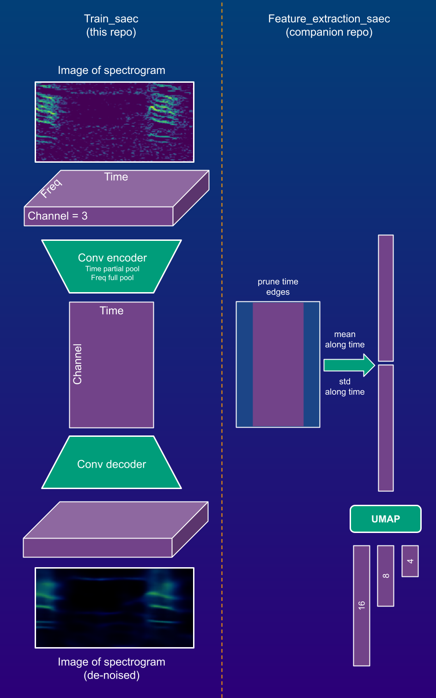

# Train auto-encoders for feature extraction from acoustic spectrograms  

### Overview
* This is a codebase for applied research with auto-encoders to extract features from spectrograms 
* It allow to define and train simple custom Pytorch auto-encoders for spectrograms
* Auto-encoders perform partial pooling of time axis (latent array representation is 2D -> channel by time)
* Specific data loader for spectrogram data to train under de-noising regime
* Trained models are meant to be used for feature extraction with companion [project](https://github.com/sergezaugg/feature_extraction_saec)
* Extracted features can be ingested by this [data annotation app](https://spectrogram-image-clustering.streamlit.app/ ) - its [repo](https://github.com/sergezaugg/spectrogram_image_clustering)

### Intallation  
* Make a fresh venv 
* Install latest package release from wheel: 
  * Go to https://github.com/sergezaugg/train_saec/releases, navigate to latest release an copy the full link.
  * e.g. ```pip install --upgrade https://github.com/sergezaugg/train_saec/releases/download/vx.x.x/train_saec-x.x.x-py3-none-any.whl```
* PyTorch deps (torch torchvision) are not included in package and must be installed separately:
  * For fast execution, **torch** and **torchvision** should to be install for GPU:
  * ```pip install torch torchvision --index-url https://download.pytorch.org/whl/cu126``` (for Windows with CUDA 12.6)
  * If other CUDA version or other OS, check official instructions [here](https://pytorch.org/get-started/locally)
  * If no GPU machine try: ```pip install torch torchvision``` This is for CPU usage 

### Usage 
* Prepare PNG formatted color images of spectrograms, e.g. with [this tool](https://github.com/sergezaugg/xeno_canto_organizer)
* [sample_code.py](main.py) illustrates a pipeline to create and train auto-encoders

### ML details



